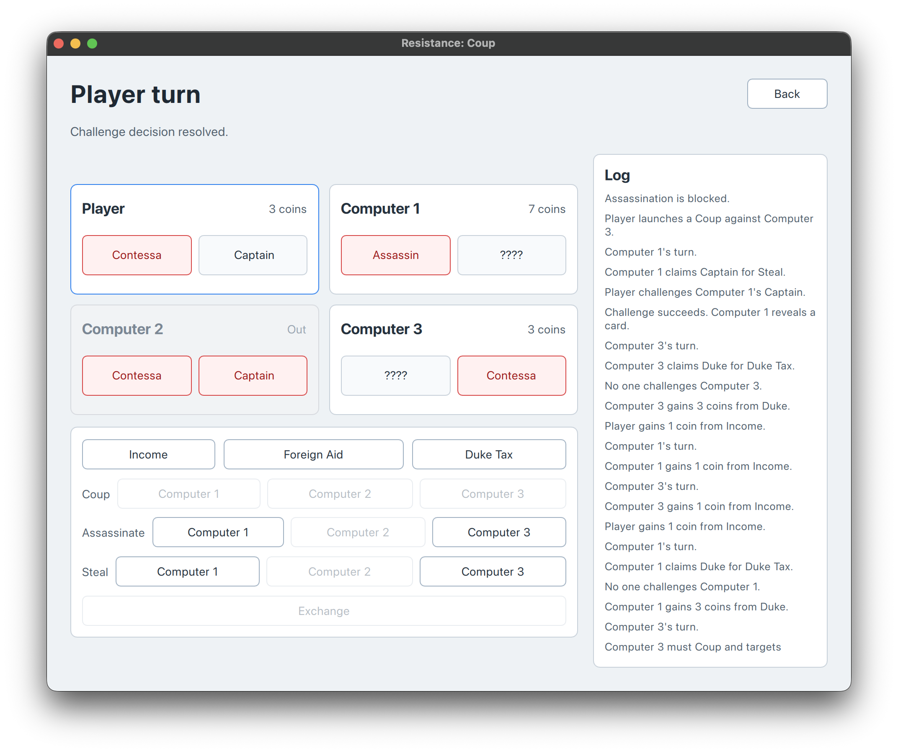
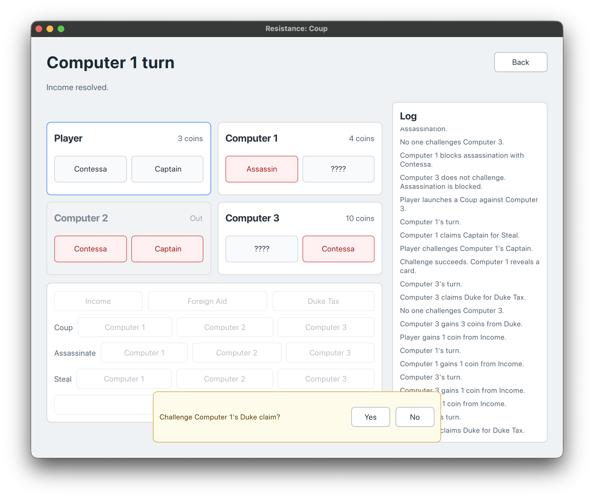

# Resistance Coup

2022년 POSTECH 객체지향프로그래밍(Object-Oriented Programming) Assignment #2로 작성한 `Resistance Coup` 게임을 C++17 기반으로 정리하고, Qt6 + QML 기반 macOS GUI 앱으로 확장한 프로젝트입니다. 한 명의 사용자 플레이어와 세 명의 컴퓨터 플레이어가 참여하며, 카드 2장이 모두 공개되지 않고 마지막까지 남은 참가자가 승리합니다.

최신 GUI 버전은 `main` 브랜치에 둡니다. 콘솔 버전 코드는 현재 브랜치에도 함께 남아 있으며, 최초 손코딩 버전은 `original` 브랜치에 보존합니다.

## Screenshots





## 과제 배경

보고서(`문서2.docx`)에 따르면 이 과제의 목표는 C++ class를 활용하여 객체지향 프로그래밍 구조를 익히는 것입니다. 상속은 사용하지 않고, 게임에 필요한 역할을 여러 클래스로 분리했습니다.

구현 대상은 보드게임 `Resistance Coup`의 간소화 버전입니다. 현재 버전은 Qt6 + QML GUI에서 플레이할 수 있으며, 핵심 게임 규칙은 Qt에 의존하지 않는 순수 C++ 로직으로 유지합니다. 컴퓨터 플레이어는 죽은 참가자를 공격하지 않는 기본 판단과 확률 기반 선택을 사용합니다.

## 게임 규칙 요약

- 참가자는 사용자 1명과 컴퓨터 3명, 총 4명입니다.
- 각 참가자는 카드 2장과 코인 2개로 시작합니다.
- 카드는 `공작`, `암살자`, `사령관`, `백작부인`을 사용합니다.
- 일반 행동으로 `소득`, `해외 원조`, `쿠`를 선택할 수 있습니다.
- 캐릭터 행동으로 공작의 코인 획득, 암살자의 암살, 사령관의 강탈을 시도할 수 있습니다.
- 다른 참가자는 특정 행동에 도전하거나 방해할 수 있습니다.
- 거짓말이 들통나면 행동한 참가자의 카드가 공개되고, 진실이면 도전한 참가자의 카드가 공개됩니다.
- 카드 2장이 모두 공개된 참가자는 탈락합니다.

## GUI 빌드 방법

macOS에서 Qt6와 CMake가 설치되어 있다면 아래 명령으로 GUI 앱을 빌드할 수 있습니다.

```bash
cmake -S . -B build-qt
cmake --build build-qt
```

## GUI 실행 방법

```bash
open build-qt/resistance_coup_gui.app
```

또는 실행 파일을 직접 실행할 수 있습니다.

```bash
./build-qt/resistance_coup_gui.app/Contents/MacOS/resistance_coup_gui
```

## 릴리스 방법

`v`로 시작하는 태그를 GitHub에 push하면 GitHub Actions가 macOS와 Windows 버전을 빌드하고, 두 zip 파일을 GitHub Release asset으로 업로드합니다.

```bash
git tag v0.1.0
git push origin v0.1.0
```

## 콘솔 버전 빌드 방법

별도의 `console` 브랜치는 없습니다. 현재 브랜치에 기존 콘솔 진입점과 `Makefile`이 남아 있으므로, 필요하면 아래 명령으로 콘솔 실행 파일을 빌드할 수 있습니다.

```bash
make
./coup_game
```

## 파일 구조

- `CMakeLists.txt`: Qt6 + QML GUI 앱 빌드 설정
- `GameState.h`: GUI와 controller가 읽는 게임 상태 snapshot 구조
- `GameEngine.h`, `GameEngine.cpp`: Qt에 의존하지 않는 순수 C++ 게임 진행 엔진
- `qt/main.cpp`: Qt GUI 앱 시작점
- `qt/GameController.h`, `qt/GameController.cpp`: QML과 순수 C++ 게임 엔진 사이의 QObject controller
- `qml/Main.qml`: GUI 앱 최상위 화면
- `qml/StartScreen.qml`: 시작 화면
- `qml/GameScreen.qml`: 게임 진행 화면
- `main.cpp`: 콘솔 버전 시작점과 메인 메뉴 처리
- `Input.h`: 숫자, y/n, Enter 입력을 안전하게 처리하는 콘솔 입력 헬퍼
- `Run.h`, `Run.cpp`: 기존 콘솔 버전의 게임 진행, 턴 처리, 도전/방해 로직
- `Player.h`, `Player.cpp`: 참가자 상태, 카드 공개, 코인 처리, 쿠 처리
- `Deck.h`, `Deck.cpp`: 덱과 카드 교환 처리
- `Card.h`, `Card.cpp`: 카드 직업과 표시 이름 관리
- `Prtstr.h`, `Prtstr.cpp`: 메뉴와 설명서 문자열 출력
- `randoms.h`, `randoms.cpp`: 난수 보조 함수
- `문서2.docx`: 2022년 과제 보고서 원본

## 브랜치 설명

- `main`: Qt6 + QML GUI 앱을 포함하는 최신 버전입니다.
- `original`: 최초 손코딩 상태를 기념하고 보존하는 브랜치입니다.

## 주요 개선 사항

- 소스 파일 인코딩을 UTF-8로 정리했습니다.
- `Makefile`과 `.gitignore`를 추가했습니다.
- `CMakeLists.txt`를 추가해 Qt6 + QML GUI 앱을 빌드할 수 있게 했습니다.
- 메뉴와 게임 설명 같은 긴 출력 문구를 `assets/text` 아래의 별도 텍스트 asset으로 분리했습니다.
- 컴파일 경고를 제거했습니다.
- 잘못된 숫자 입력으로 `cin`이 실패하거나 배열 범위를 벗어날 수 있던 문제를 방지했습니다.
- Enter 대기와 y/n 입력을 공통 입력 헬퍼로 정리했습니다.
- 공개된 카드는 더 이상 활성 카드로 판정하지 않도록 수정했습니다.
- 강탈 시 상대 코인이 음수가 되지 않도록 실제 보유 코인만 빼앗게 했습니다.
- 컴퓨터의 방해 확률과 일부 출력 문구를 바로잡았습니다.
- Qt에 의존하지 않는 `GameEngine`/`GameState` 계층을 추가했습니다.
- QML에서 `GameController`를 통해 현재 턴, 플레이어 상태, 로그, challenge/counteraction 결정을 주고받을 수 있게 했습니다.
- GUI에서 Income, Foreign Aid, Coup, Duke Tax, Assassinate, Steal 흐름을 진행할 수 있게 했습니다.

## 참고

- `문서2.docx`: Object-Oriented Programming Assignment #2 Resistance Coup 보고서
- 김정헌, `Assignment2.pdf`, Flow chart, 2022
